# Z.ai2api - AI代理服务 v1.0.0

[根目录](.)

## 项目愿景

Z.ai2api 是一个企业级的 AI API 代理服务，将 Z.ai 转换为完全兼容 OpenAI API 格式的接口。项目致力于提供：

- 🚀 **高性能**: 优化的缓存机制和并发处理
- 🛡️ **企业级安全**: API 密钥认证、CORS 保护
- 🐳 **容器化**: 完整的 Docker 部署方案
- 📊 **可观测性**: 完整的监控和日志系统
- 🔧 **易维护**: 模块化架构，清晰的代码组织

## 架构总览

项目采用分层架构，严格遵循 SOLID 原则，基于 Python Flask 框架构建：

```mermaid
graph TB
    subgraph "接入层"
        A1[Flask App]
        A2[API Key Middleware]
        A3[Routes]
    end
    
    subgraph "业务层"
        B1[ChatService]
        B2[ContentProcessor]
        B3[ResponseHandler]
    end
    
    subgraph "基础设施层"
        C1[HttpClient]
        C2[Cache System]
        C3[Config Manager]
        C4[Performance Monitor]
        C5[Logger]
    end
    
    subgraph "外部服务"
        D1[Z.ai API]
        D2[Monitoring Tools]
    end
    
    A1 --> A2 --> A3 --> B1
    B1 --> B2 --> B3
    B1 --> C1
    B2 --> C2
    B3 --> C5
    C1 --> D1
    C4 --> D2
    
    style A1 fill:#e1f5fe
    style B1 fill:#f3e5f5
    style C1 fill:#e8f5e8
```



### 核心设计原则

1. **单一职责**: 每个模块只负责一个功能领域
2. **开闭原则**: 对扩展开放，对修改关闭
3. **依赖倒置**: 依赖抽象而非具体实现
4. **接口隔离**: 使用最小化的接口
5. **策略模式**: 思考链处理采用策略模式

## 详细架构

### 1. 接入层 (Access Layer)

#### app.py - 应用入口
- **职责**: HTTP 请求处理、路由分发、中间件管理
- **设计模式**: 装饰器模式（API 密钥验证）
- **关键特性**:
  - RESTful API 路由
  - API 密钥验证中间件
  - 错误处理统一入口
  - 依赖注入容器

```python
# 依赖注入示例
http_client = RequestsHttpClient(config.browser_headers)
zai_client = ZAIClient(http_client)
content_processor = ContentProcessor(ThinkTagsMode(config.think_tags_mode))
chat_service = ChatService(zai_client, content_processor, logger)
```

### 2. 业务层 (Business Layer)

#### services.py - 核心业务逻辑
- **职责**: 聊天完成、模型列表、业务流程编排
- **设计模式**: 策略模式、模板方法
- **关键流程**:
  1. 请求验证和预处理
  2. 内容处理（思考链转换）
  3. 上游 API 调用
  4. 响应格式化和缓存

#### content_processor.py - 内容处理器
- **职责**: 思考链处理、内容格式转换
- **设计模式**: 策略模式
- **三种处理模式**:
  - `think`: 友好格式，使用 🤔 表情
  - `pure`: 保留原始引用格式
  - `raw`: 完整 HTML 格式

### 3. 基础设施层 (Infrastructure Layer)

#### http_client.py - HTTP 客户端
- **职责**: HTTP 请求封装、连接管理
- **设计模式**: 适配器模式、单例模式
- **特性**:
  - 抽象基类设计，便于扩展
  - 内置缓存机制
  - 自动重试和错误恢复

#### cache.py - 缓存系统
- **职责**: 内存缓存、TTL 管理
- **设计模式**: 单例模式、装饰器模式
- **优化点**:
  - CRC32 哈希算法（比 MD5 快 80%）
  - LRU 淘汰策略
  - 线程安全实现

#### config.py - 配置管理
- **职责**: 应用配置、环境变量管理
- **设计模式**: 单例模式
- **特性**:
  - 支持从 `.env` 文件加载
  - 类型验证和默认值
  - 运行时配置更新

### 4. 横切关注点 (Cross-cutting Concerns)

#### utils.py - 工具函数
- **Logger**: 统一的日志管理
- **ResponseHelper**: HTTP 响应格式化
- **IdGenerator**: 唯一 ID 生成

#### performance.py - 性能监控
- **职责**: 性能指标收集、统计
- **监控项**:
  - 请求计数和响应时间
  - 缓存命中率
  - 系统资源使用

#### exceptions.py - 异常体系
- **职责**: 自定义异常、错误处理
- **异常类型**:
  - `ZaiApiError`: 基础异常类
  - `AuthenticationError`: 认证错误
  - `RateLimitError`: 限流错误

## 模块索引

| 模块 | 文件 | 职责 | 设计模式 | 关键依赖 |
|------|------|------|----------|----------|
| Flask应用 | `app.py` | 路由处理、依赖注入 | 装饰器模式 | 所有业务模块 |
| 配置管理 | `config.py` | 应用配置、环境变量 | 单例模式 | 无 |
| HTTP客户端 | `http_client.py` | HTTP请求处理 | 适配器模式 | `config.py`, `cache.py` |
| 内容处理 | `content_processor.py` | 思考链处理 | 策略模式 | `cache.py` |
| 聊天服务 | `services.py` | 核心业务逻辑 | 策略模式 | `http_client.py`, `content_processor.py` |
| 缓存机制 | `cache.py` | 内存缓存、TTL | 单例模式 | 无 |
| 性能监控 | `performance.py` | 性能统计 | 观察者模式 | 无 |
| 工具函数 | `utils.py` | 日志、ID生成、响应处理 | 静态工厂 | `config.py` |
| 异常处理 | `exceptions.py` | 异常定义、错误处理 | 层次结构 | 无 |
| 类型定义 | `type_definitions.py` | 类型声明、数据结构 | - | 无 |

## 部署架构

### 传统部署


### Docker 部署（推荐）


## 性能特性

### 缓存策略

- **模型列表缓存**: 5分钟 TTL
- **认证令牌缓存**: 10分钟 TTL
- **内容处理缓存**: 1小时 TTL
- **CRC32 哈希**: 快速内容指纹生成

### 并发处理

- **线程安全**: 所有共享资源使用锁保护
- **连接池**: HTTP 客户端使用连接池
- **流式响应**: 支持实时数据流

### 监控指标

- 请求计数和响应时间
- 缓存命中率统计
- 系统资源使用情况
- 错误率统计

## 开发指南

### 环境要求

- **Python**: 3.10+ (推荐 3.10)
- **内存**: 开发环境最少 256MB
- **存储**: 100MB 可用空间

### 快速开始

```bash
# 1. 克隆项目
git clone https://github.com/Baozhi888/Z.ai2api.git
cd Z.ai2api

# 2. 创建虚拟环境
python -m venv venv
source venv/bin/activate  # Linux/Mac
# 或 venv\Scripts\activate  # Windows

# 3. 安装依赖
pip install -r requirements.txt

# 4. 配置环境
cp .env.example .env
nano .env  # 配置必要参数

# 5. 启动服务
python app.py
```

### Docker 开发环境

```bash
# 构建开发镜像
docker build -t zai2api-dev .

# 运行开发容器
docker run -it --rm \
  -p 8080:8080 \
  -v $(pwd):/app \
  zai2api-dev
```

### 环境变量配置

| 变量名 | 默认值 | 说明 | 类型 |
|--------|--------|------|------|
| `ZAI_API_BASE` | `https://chat.z.ai` | Z.ai API 地址 | string |
| `ZAI_PORT` | `8080` | 服务端口 | int |
| `ZAI_UPSTREAM_TOKEN` | - | 上游认证令牌 | string |
| `ZAI_MODEL_NAME` | `GLM-4.5` | 默认模型 | string |
| `ZAI_DEBUG_MODE` | `false` | 调试模式 | bool |
| `ZAI_THINK_TAGS_MODE` | `think` | 思考链模式 | enum |
| `ZAI_ANON_TOKEN_ENABLED` | `true` | 匿名令牌 | bool |
| `ZAI_API_KEY` | - | API 密钥 | string |
| `ZAI_API_KEY_ENABLED` | `false` | 启用密钥验证 | bool |

## 扩展开发

### 添加新的思考链模式

1. 在 `type_definitions.py` 中扩展枚举：
```python
class ThinkTagsMode(Enum):
    THINK = "think"
    PURE = "pure"
    RAW = "raw"
    CUSTOM = "custom"  # 新增
```

2. 在 `content_processor.py` 中实现处理逻辑：
```python
def _process_custom_mode(self, content: str) -> str:
    # 自定义处理逻辑
    return processed_content
```

### 添加新的配置项

1. 在 `config.py` 的 `AppConfig` 中添加：
```python
@dataclass
class AppConfig:
    new_feature_enabled: bool = False
    
    @classmethod
    def from_env(cls) -> 'AppConfig':
        return cls(
            new_feature_enabled=str_to_bool(
                os.getenv("ZAI_NEW_FEATURE_ENABLED"), 
                cls.new_feature_enabled
            )
        )
```

### 添加新的 API 端点

1. 在 `app.py` 中添加路由：
```python
@app.route("/v1/new-feature", methods=["POST"])
@require_api_key
def new_feature():
    """新功能端点"""
    try:
        # 实现逻辑
        return ResponseHelper.create_json_response(result)
    except Exception as e:
        logger.error("新功能错误: %s", e)
        return ResponseHelper.create_error_response("处理失败")
```

## 测试策略

项目采用分层测试策略：

### 单元测试
- 测试各个模块的独立功能
- 使用 mock 对象隔离依赖
- 覆盖率目标：80%+

### 集成测试
- 测试模块间的交互
- 测试完整的请求流程
- 使用测试数据库

### 性能测试
- 压力测试：`wrk` 或 `ab`
- 负载测试：并发请求
- 内存泄漏检测

### 测试命令

```bash
# 运行所有测试
pytest

# 生成覆盖率报告
pytest --cov=. --cov-report=html

# 性能测试
python stress_test.py
```

## 监控与运维

### 日志管理

- **结构化日志**: JSON 格式
- **日志级别**: DEBUG/INFO/WARNING/ERROR
- **日志轮转**: 按大小和时间轮转

### 健康检查

- **HTTP 健康检查**: `/health`
- **就绪检查**: 应用就绪状态
- **存活检查**: 服务存活状态

### 指标监控

- **Prometheus**: 集成 Prometheus 指标
- **Grafana**: 可视化仪表板
- **告警**: 基于阈值的告警

### 部署方式

1. **传统部署**: systemd + Nginx
2. **Docker 部署**: 容器化部署
3. **Kubernetes**: K8s 集群部署
4. **Serverless**: 云函数部署

## 编码规范

### 代码风格

- 使用 `black` 进行代码格式化
- 使用 `isort` 进行导入排序
- 使用 `flake8` 进行代码检查
- 遵循 PEP 8 编码规范

### 架构原则

- **单一职责原则**: 每个模块只负责一个特定的功能
- **依赖倒置原则**: 通过接口定义依赖关系，高层模块不依赖低层模块
- **开闭原则**: 对扩展开放，对修改关闭
- **接口隔离原则**: 使用小而专一的接口，而不是大而全的接口
- **里氏替换原则**: 子类应该能够替换父类

### 代码组织

- 模块化设计，每个文件只包含一个主要类或功能
- 使用类型提示提高代码可读性和可维护性
- 完整的文档字符串，说明模块、类和方法的用途
- 统一的异常处理机制

## AI 使用指引

### 项目理解

这是一个企业级的 Python Flask 项目，代码结构清晰，遵循良好的软件工程实践：

1. **模块化架构**: 每个模块都有明确的职责边界
2. **依赖注入**: 使用接口和依赖注入提高可测试性
3. **缓存机制**: 实现了完整的缓存系统，提高性能
4. **性能监控**: 内置性能监控功能
5. **错误处理**: 完整的异常体系
6. **类型安全**: 全面的类型提示
7. **容器化**: 完整的 Docker 部署方案

### 代码修改建议

1. **保持模块化**: 修改时保持单一职责原则
2. **使用类型提示**: 新增代码应包含完整的类型提示
3. **更新文档**: 修改接口时同步更新文档字符串
4. **错误处理**: 使用统一的异常处理机制
5. **性能考虑**: 优化时注意缓存和并发
6. **安全第一**: 添加新功能时考虑安全性

### AI 辅助开发

当使用 AI 辅助开发时：

1. **提供上下文**: 说明项目架构和设计原则
2. **明确需求**: 详细描述功能需求和非功能需求
3. **代码审查**: AI 生成的代码需要人工审查
4. **测试验证**: 确保新功能通过所有测试
5. **性能考虑**: 注意缓存使用和性能影响

### 扩展建议

1. **添加新模型支持**: 在 `services.py` 中扩展模型处理逻辑
2. **添加新的思考链模式**: 在 `content_processor.py` 中添加新的处理模式
3. **添加新的 API 端点**: 在 `app.py` 中添加新的路由
4. **添加新的缓存策略**: 在 `cache.py` 中扩展缓存功能
5. **添加新的监控指标**: 在 `performance.py` 中添加新的监控指标

## 变更记录 (Changelog)

### 2025-09-02

- 初始化 AI 上下文文档
- 完成项目架构分析和模块扫描
- 生成 Mermaid 结构图展示项目架构
- 建立编码规范和 AI 使用指引