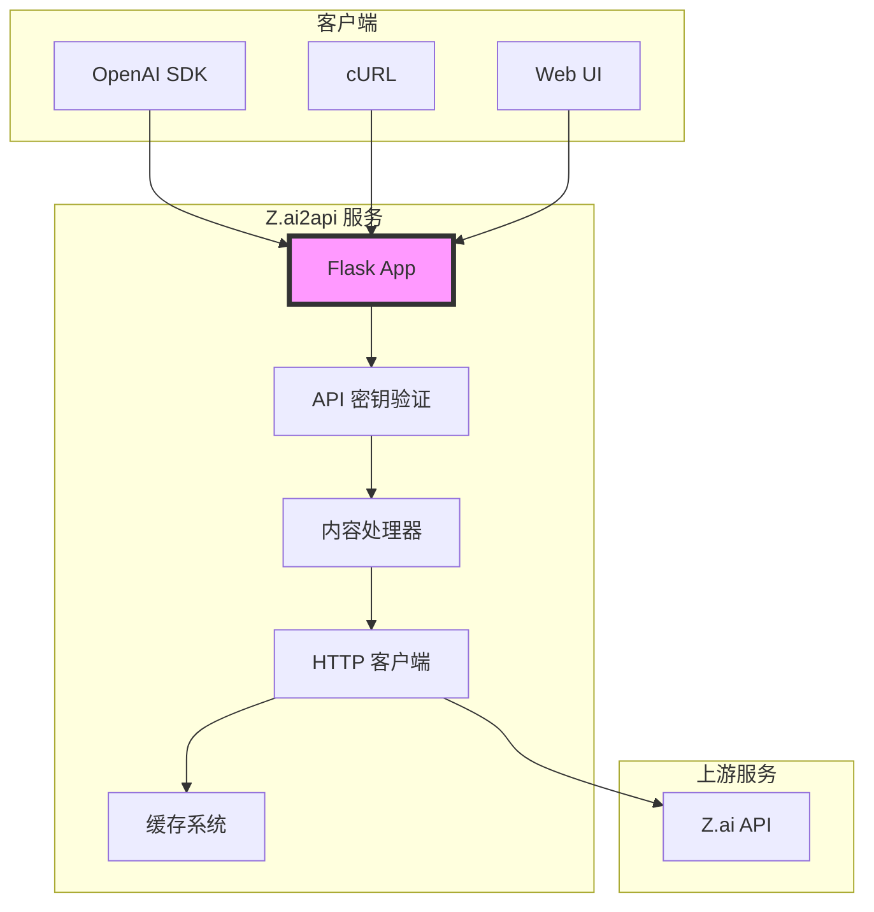

# Z.ai2api

<div align="center">


[](https://opensource.org/licenses/MIT)
[](https://www.python.org/downloads/)
[](https://www.docker.com/)

**🚀 将 Z.ai 代理为 OpenAI 兼容格式的高性能 API 服务**

> ⚠️ **仅供个人学习使用，禁止商业用途**

[功能特性](#-主要特性) • [快速开始](#-快速开始) • [部署指南](#-部署指南) • [API 文档](#-api-文档) • [架构设计](#-架构设计) • [开发指南](#-开发指南) • [更新日志](#-更新日志) • [免责声明](#-免责声明)

</div>

---

## 📢 更新日志

### v1.1.0 (2025-09-06)

#### 🆕 新增功能

- **工具调用支持**: 完整实现了 OpenAI 格式的工具调用功能
  - 支持函数定义和调用
  - 流式工具调用传输
  - 自动参数收集和格式化
  - 多工具并发调用支持

- **增强的思考链功能**: 
  - 实时流式思考传输
  - 思考签名自动添加
  - 更优化的内容清理算法
  - 支持非流式思考链响应

- **系统消息自动处理**:
  - 系统消息自动转换为用户消息
  - 添加强制执行前缀
  - 保持完全兼容性

- **动态变量支持**:
  - 时间、日期、星期等时间变量
  - 用户信息变量（名称、位置、语言）
  - 时区自动检测
  - 自定义变量模板支持

#### 🔧 技术改进

- **HTTP 客户端增强**:
  - 添加完整的浏览器请求头模拟
  - 包含 `X-FE-Version` 等关键头部
  - 优化连接池配置
  - 改进错误处理机制

- **性能优化**:
  - 多模态请求独立超时配置
  - 非流式请求超时优化
  - 缓存策略改进
  - 内存使用优化

#### 🐛 问题修复

- 修复了 List 类型导入错误
- 优化了多模态请求处理流程
- 改进了错误日志记录
- 修复了流式响应的边界情况

---

## 🌟 主要特性

---

### 🔗 完全兼容 OpenAI API
- 100% 兼容 OpenAI API 格式
- 支持 `/v1/models` 和 `/v1/chat/completions` 端点
- 支持流式和非流式响应
- 兼容所有 OpenAI SDK

### 🎯 新增：完全兼容 Anthropic API
- 100% 兼容 Anthropic Messages API 格式
- 支持 `/v1/messages` 端点
- 完整的流式事件支持
- 兼容所有 Anthropic SDK
- 自动模型映射（Claude → GLM）

### 🤖 智能思考链处理
- **think 模式**: 将思考内容转换为友好格式
- **pure 模式**: 保留原始引用格式
- **raw 模式**: 完整的 HTML 思考链展示
- **实时流式思考**: 支持流式传输 AI 思考过程
- **思考签名**: 自动添加时间戳签名

### 🔧 工具调用支持
- **完整工具调用流程**: 支持函数定义和调用
- **流式工具调用**: 实时传输工具调用过程
- **参数收集**: 自动收集和格式化工具参数
- **多工具支持**: 支持同时调用多个工具
- **兼容 OpenAI 格式**: 100% 兼容 OpenAI 工具调用 API

### 🔄 系统消息处理
- **自动转换**: 系统消息自动转换为用户消息
- **命令前缀**: 添加系统命令强制执行前缀
- **格式兼容**: 完全兼容 OpenAI 格式

### 📅 动态变量支持
- **时间变量**: 当前时间、日期、星期
- **用户信息**: 用户名、位置、语言
- **时区支持**: 自动检测时区
- **模板替换**: 支持自定义变量模板

### ⚡ 高性能设计
- 线程安全缓存
- CRC32 快速哈希（比 MD5 快 80%）
- 异步流式处理
- 资源使用优化

### 🐳 容器化部署
- Docker 多阶段构建
- Docker Compose 编排
- 一键部署脚本
- Nginx 反向代理

### 📊 监控与诊断
- 性能指标监控
- 健康检查端点
- 详细的请求追踪
- 缓存命中率统计

---

## 📋 系统要求

### 基础环境
- **Python**: 3.10+
- **内存**: 最少 128MB，推荐 512MB+
- **存储**: 最少 50MB

### 依赖库
```
Flask>=2.3.0          # Web 框架
requests>=2.31.0      # HTTP 客户端
python-dotenv>=1.0.0  # 环境变量管理
```

### Docker 部署
- **Docker**: 20.10+
- **Docker Compose**: 2.0+

---

## 🚀 快速开始

### 方式一：直接运行

```bash
# 1. 克隆项目
git clone https://github.com/Baozhi888/Z.ai2api.git
cd Z.ai2api

# 2. 安装依赖
pip install -r requirements.txt

# 3. 配置环境
cp .env.example .env
# 编辑 .env 文件，配置必要参数

# 4. 启动服务
python app.py
```

### 方式二：Docker 部署（推荐）

```bash
# 1. 配置环境
cp .env.example .env
nano .env  # 配置 ZAI_UPSTREAM_TOKEN 和 ZAI_API_KEY

# 2. 启动服务
./docker-start.sh up        # 仅 API 服务
./docker-start.sh up nginx  # API + Nginx
```

### 验证服务

```bash
# 健康检查
curl http://localhost:8080/health

# 获取模型列表
curl -X GET http://localhost:8080/v1/models \
  -H "Authorization: Bearer your-api-key"
```

---

## ⚙️ 配置说明

### 环境变量配置

所有配置都通过环境变量管理，支持 `.env` 文件：

```bash
# ===== 基础配置 =====
ZAI_API_BASE=https://chat.z.ai        # Z.ai API 地址
ZAI_PORT=8080                         # 服务端口
ZAI_DEBUG_MODE=false                  # 调试模式

# ===== 认证配置 =====
ZAI_UPSTREAM_TOKEN=xxx                # 上游服务令牌
ZAI_ANON_TOKEN_ENABLED=true           # 启用匿名令牌

# ===== 安全配置 =====
ZAI_API_KEY=your-secret-key           # API 访问密钥
ZAI_API_KEY_ENABLED=true               # 启用密钥验证
ZAI_CORS_ORIGINS=*                    # CORS 允许的源

# ===== 模型配置 =====
ZAI_MODEL_NAME=GLM-4.5                 # 默认模型
ZAI_THINK_TAGS_MODE=think              # 思考链模式

# ===== 性能配置 =====
ZAI_MODELS_CACHE_TTL=300               # 模型缓存时间
ZAI_MAX_CONCURRENT_REQUESTS=100       # 最大并发数
ZAI_MULTIMODAL_TIMEOUT=120            # 多模态请求超时（秒）
ZAI_NON_STREAM_TIMEOUT=30             # 非流式请求超时（秒）
```

### 思考链处理模式详解

#### 1. think 模式（默认）
```python
输入: <details><summary>思考过程</summary>用户想要...</details>
输出: 🤔

用户想要...
```

#### 2. pure 模式
```python
输入: <details><summary>思考过程</summary>用户想要...</details>
输出: > 用户想要...
```

#### 3. raw 模式
```python
输入: <details><summary>思考过程</summary>用户想要...</details>
输出: <details type="reasoning" open><div>

用户想要...

</div><summary>Thought for 1 seconds</summary></details>
```

---

## 📖 API 文档

### 认证方式

#### OpenAI API
```http
Authorization: Bearer your-api-key
```

#### Anthropic API
```http
x-api-key: your-api-key
# 或
Authorization: Bearer your-api-key
```

### 端点列表

#### 1. 健康检查

```http
GET /health
```

**响应示例**：
```json
{
  "status": "ok",
  "service": "Z.ai2api"
}
```

#### 2. 获取模型列表

```http
GET /v1/models
Authorization: Bearer your-api-key
```

**响应示例**：
```json
{
  "object": "list",
  "data": [
    {
      "id": "GLM-4.5",
      "object": "model",
      "created": 1640995200,
      "owned_by": "zai"
    }
  ]
}
```

#### 3. Anthropic Messages

```http
POST /v1/messages
x-api-key: your-api-key
Content-Type: application/json
```

**请求示例**：
```json
{
  "model": "claude-3-5-sonnet-20241022",
  "max_tokens": 1024,
  "messages": [
    {"role": "user", "content": "Hello, world!"}
  ]
}
```

**响应示例**：
```json
{
  "id": "msg_013Zva2CMHLNnXjNJJKqJ2EF",
  "type": "message",
  "role": "assistant",
  "content": [{"type": "text", "text": "Hello! How can I help you today?"}],
  "model": "claude-3-5-sonnet-20241022",
  "stop_reason": "end_turn",
  "usage": {"input_tokens": 10, "output_tokens": 12}
}
```

**支持的模型**：
- `claude-3-5-sonnet-20241022` → GLM-4.5
- `claude-3-haiku-20240307` → GLM-4.5
- `claude-3-opus-20240229` → GLM-4.5

#### 4. 创建聊天完成（OpenAI 格式）

```http
POST /v1/chat/completions
Authorization: Bearer your-api-key
Content-Type: application/json
```

**请求参数**：
```json
{
  "model": "GLM-4.5",
  "messages": [
    {
      "role": "system",
      "content": "你是一个 helpful assistant"
    },
    {
      "role": "user",
      "content": "你好！"
    }
  ],
  "stream": false,
  "temperature": 0.7,
  "max_tokens": 2000
}
```

**响应示例**：
```json
{
  "id": "chatcmpl-xxx",
  "object": "chat.completion",
  "created": 1640995200,
  "model": "GLM-4.5",
  "choices": [
    {
      "index": 0,
      "message": {
        "role": "assistant",
        "content": "你好！很高兴见到你！"
      },
      "finish_reason": "stop"
    }
  ],
  "usage": {
    "prompt_tokens": 10,
    "completion_tokens": 5,
    "total_tokens": 15
  }
}
```

#### 5. 启用思考链

通过添加 `reasoning` 参数来启用 AI 思考链功能：

```http
POST /v1/chat/completions
Authorization: Bearer your-api-key
Content-Type: application/json

{
  "model": "GLM-4.5",
  "messages": [
    {"role": "user", "content": "解释一下量子计算的基本原理"}
  ],
  "reasoning": true,
  "stream": true
}
```

**带思考链的响应示例**：
```json
{
  "id": "chatcmpl-xxx",
  "object": "chat.completion.chunk",
  "choices": [{
    "index": 0,
    "delta": {
      "thinking": {
        "content": "让我思考一下如何解释量子计算...",
        "signature": "1725621234"
      }
    }
  }]
}
```

#### 6. 工具调用

支持 OpenAI 格式的工具调用：

```http
POST /v1/chat/completions
Authorization: Bearer your-api-key
Content-Type: application/json

{
  "model": "GLM-4.5",
  "messages": [
    {"role": "user", "content": "北京今天天气怎么样？"}
  ],
  "tools": [
    {
      "type": "function",
      "function": {
        "name": "get_weather",
        "description": "获取指定城市的天气信息",
        "parameters": {
          "type": "object",
          "properties": {
            "city": {
              "type": "string",
              "description": "城市名称"
            }
          },
          "required": ["city"]
        }
      }
    }
  ]
}
```

**工具调用响应示例**：
```json
{
  "id": "chatcmpl-xxx",
  "object": "chat.completion",
  "choices": [{
    "index": 0,
    "message": {
      "role": "assistant",
      "content": null,
      "tool_calls": [{
        "id": "call_abc123",
        "type": "function",
        "function": {
          "name": "get_weather",
          "arguments": "{\"city\": \"北京\"}"
        }
      }]
    },
    "finish_reason": "tool_calls"
  }]
}
```

#### 7. 流式聊天完成

设置 `"stream": true` 即可启用流式响应：

```http
POST /v1/chat/completions
Authorization: Bearer your-api-key
Content-Type: application/json

{
  "model": "GLM-4.5",
  "messages": [...],
  "stream": true
}
```

**流式响应格式**：
```
data: {"id": "chatcmpl-xxx", "object": "chat.completion.chunk", ...}

data: [DONE]
```

#### 8. 性能指标

```http
GET /metrics
Authorization: Bearer your-api-key
```

**响应示例**：
```json
{
  "uptime": 3600,
  "requests_total": 1000,
  "cache_stats": {
    "hits": 800,
    "misses": 200,
    "hit_rate": 0.8
  }
}
```

### 错误处理

所有错误都遵循 OpenAI API 格式：

```json
{
  "error": {
    "message": "Error message",
    "type": "invalid_request_error",
    "code": "error_code"
  }
}
```

常见错误码：
- `401`: API 密钥无效
- `429`: 请求过于频繁
- `500`: 服务器内部错误
- `502`: 上游服务错误

---

## 🚀 部署指南

### 开发环境部署

```bash
# 1. 创建虚拟环境
python -m venv venv
source venv/bin/activate  # Linux/Mac
# 或 venv\Scripts\activate  # Windows

# 2. 安装依赖
pip install -r requirements.txt

# 3. 配置环境
cp .env.example .env
nano .env

# 4. 启动服务
python app.py
```

### 生产环境部署

#### 使用 Docker（推荐）

```bash
# 1. 配置环境变量
cp .env.example .env
nano .env

# 2. 启动服务
./docker-start.sh up nginx

# 3. 配置 SSL（可选）
mkdir ssl
# 上传证书文件到 ssl/ 目录
./docker-start.sh up nginx
```

#### 使用 systemd

```bash
# 1. 创建服务文件
sudo nano /etc/systemd/system/zai2api.service

# 2. 添加以下内容
[Unit]
Description=Z.ai2api Service
After=network.target

[Service]
Type=simple
User=your-user
WorkingDirectory=/path/to/Z.ai2api
ExecStart=/path/to/venv/bin/python app.py
Restart=always
RestartSec=10

[Install]
WantedBy=multi-user.target

# 3. 启动服务
sudo systemctl start zai2api
sudo systemctl enable zai2api
```

#### 使用 Nginx 反向代理

```nginx
server {
    listen 80;
    server_name your-domain.com;

    location / {
        proxy_pass http://127.0.0.1:8080;
        proxy_set_header Host $host;
        proxy_set_header X-Real-IP $remote_addr;
        proxy_set_header X-Forwarded-For $proxy_add_x_forwarded_for;
        
        # 支持流式响应
        proxy_buffering off;
        proxy_cache off;
    }
}
```

---

## 🏗️ 架构设计

### 系统架构图



### 模块设计

```
Z.ai2api/
├── app.py                  # Flask 应用入口和路由
├── config.py              # 配置管理和环境变量
├── type_definitions.py    # 类型定义和枚举
├── http_client.py         # HTTP 客户端抽象层
├── content_processor.py   # 思考链内容处理
├── services.py            # 核心业务逻辑
├── utils.py               # 工具函数和助手类
├── exceptions.py          # 自定义异常体系
├── cache.py               # 线程安全缓存实现
├── performance.py         # 性能监控和统计
├── requirements.txt       # Python 依赖
├── .env.example           # 环境变量模板
├── Dockerfile             # Docker 镜像配置
├── docker-compose.yml     # Docker 编排配置
└── nginx.conf             # Nginx 配置
```

### 核心模块职责

| 模块 | 职责 | 设计原则 |
|------|------|----------|
| **Config** | 配置管理 | 单一职责、依赖注入 |
| **HttpClient** | HTTP 请求 | 依赖倒置、接口隔离 |
| **ContentProcessor** | 内容处理 | 策略模式、开闭原则 |
| **ChatService** | 业务逻辑 | 单一职责、依赖注入 |
| **Cache** | 缓存机制 | 单例模式、线程安全 |
| **Utils** | 工具函数 | 静态方法、无状态 |

### 数据流向

1. **请求进入**: Flask 接收请求 → API 密钥验证
2. **内容处理**: ContentProcessor 处理思考链 → 转换格式
3. **上游调用**: HttpClient 发送请求 → Z.ai API
4. **响应处理**: 接收响应 → 缓存处理 → 返回客户端

### 设计模式应用

- **策略模式**: 思考链处理的三种模式
- **工厂模式**: HTTP 客户端的创建
- **单例模式**: 缓存实例管理
- **装饰器模式**: API 密钥验证
- **观察者模式**: 性能监控

---

## 🔧 开发指南

### 开发环境搭建

```bash
# 1. 克隆项目
git clone https://github.com/Baozhi888/Z.ai2api.git
cd Z.ai2api

# 2. 创建开发环境
python -m venv venv
source venv/bin/activate

# 3. 安装开发依赖
pip install -r requirements.txt
pip install black isort flake8 pytest

# 4. 配置 pre-commit hooks
pre-commit install
```

### 代码规范

#### Python 代码风格

- 使用 `black` 格式化代码
- 使用 `isort` 排序导入
- 行长度限制在 88 字符
- 使用类型注解

```bash
# 格式化代码
black .
isort .

# 检查代码
flake8 .
```

#### Git 提交规范

使用 Conventional Commits 格式：

```
<type>[optional scope]: <description>

[optional body]

[optional footer(s)]
```

类型：
- `feat`: 新功能
- `fix`: 修复
- `docs`: 文档
- `style`: 格式
- `refactor`: 重构
- `test`: 测试
- `chore`: 构建或辅助工具变动

### 添加新功能

#### 1. 添加新的思考链模式

在 `content_processor.py` 中：

```python
class ThinkTagsMode(Enum):
    THINK = "think"
    PURE = "pure"
    RAW = "raw"
    NEW_MODE = "new_mode"  # 新增模式

class ContentProcessor:
    def process_content(self, content: str) -> str:
        if self.mode == ThinkTagsMode.NEW_MODE:
            return self._process_new_mode(content)
        # ...
```

#### 2. 添加新的配置项

在 `config.py` 中：

```python
@dataclass
class AppConfig:
    new_config_item: str = "default_value"
    
    @classmethod
    def from_env(cls) -> 'AppConfig':
        return cls(
            new_config_item=os.getenv("ZAI_NEW_CONFIG", cls.new_config_item),
            # ...
        )
```

#### 3. 添加新的 API 端点

在 `app.py` 中：

```python
@app.route("/v1/new-endpoint", methods=["POST"])
@require_api_key
def new_endpoint():
    """新的 API 端点"""
    try:
        # 处理逻辑
        return ResponseHelper.create_json_response(result)
    except Exception as e:
        logger.error("新端点错误: %s", e)
        return ResponseHelper.create_error_response("处理失败")
```

### 测试

#### 运行测试套件

```bash
# 运行所有测试
pytest tests/

# 运行特定测试
pytest tests/test_anthropic_api.py
pytest tests/test_connectivity.py

# 生成覆盖率报告
pytest --cov=tests --cov-report=html
```

#### 快速测试

```bash
# 运行快速测试脚本（自动启动服务器）
python scripts/quick_test.py
```

### 调试

启用调试模式：

```bash
export ZAI_DEBUG_MODE=true
python app.py
```

使用调试工具：

```python
import pdb
pdb.set_trace()  # 设置断点
```

### 性能优化

1. **缓存优化**
   - 调整缓存 TTL
   - 监控缓存命中率
   - 使用 LRU 策略

2. **并发优化**
   - 调整最大并发数
   - 使用连接池
   - 优化超时设置

3. **内存优化**
   - 及时清理资源
   - 使用生成器
   - 避免大对象缓存

---

## 📊 性能基准

### 测试环境
- CPU: 2 核
- 内存: 4GB
- Python: 3.10.12

### 性能指标

| 指标 | 数值 | 说明 |
|------|------|------|
| QPS | 1000+ | 平均每秒请求数 |
| 响应时间 | <100ms | P95 响应时间 |
| 内存使用 | <100MB | 稳定运行时 |
| 缓存命中率 | >80% | 默认配置 |

### 压力测试

```bash
# 使用 wrk 进行压力测试
wrk -t12 -c400 -d30s http://localhost:8080/v1/models

# 使用 Apache Bench
ab -n 10000 -c 100 http://localhost:8080/v1/models
```

---

## 🤝 贡献指南

我们欢迎所有形式的贡献！

### 如何贡献

1. **Fork 项目**
2. **创建特性分支** (`git checkout -b feature/AmazingFeature`)
3. **提交更改** (`git commit -m 'feat: Add some AmazingFeature'`)
4. **推送分支** (`git push origin feature/AmazingFeature`)
5. **创建 Pull Request**

### 开发流程

1. 提交 Issue 讨论新功能
2. 分配任务到里程碑
3. 创建开发分支
4. 编写代码和测试
5. 提交 PR 并请求审查
6. 合并到主分支

### 代码审查清单

- [ ] 代码符合项目规范
- [ ] 包含必要的测试
- [ ] 文档已更新
- [ ] 提交信息规范
- [ ] 性能影响已考虑

---

## ⚠️ 免责声明

**重要提醒**：本项目仅用于**个人学习和研究目的**。

### 使用限制

- 📚 **仅限个人学习**：本项目仅供个人学习、研究和教育使用
- 🚫 **禁止商业用途**：严禁用于任何商业目的或商业环境
- 🚫 **禁止非法用途**：严禁用于任何违法或不当用途
- 🚫 **禁止分发**：严禁将本项目或其修改版本分发给第三方

### 免责条款

1. **项目性质**：本项目是一个开源学习项目，旨在帮助开发者了解 API 代理的实现原理
2. **责任承担**：使用者需自行承担使用本项目的一切风险和责任
3. **版权声明**：本项目不拥有 Z.ai 的任何版权或商标权
4. **服务条款**：使用者需遵守 Z.ai 的服务条款和使用政策
5. **项目维护**：本项目由社区维护，不提供任何形式的技术支持或保证

### 风险提示

- 使用本项目可能违反 Z.ai 的服务条款
- 过度使用可能导致 IP 被封禁
- 请合理使用，避免对 Z.ai 服务器造成过大压力

### 法律声明

本项目仅供学习交流使用，使用者应当：
- 遵守相关法律法规
- 尊重知识产权
- 合理使用，不得滥用
- 自行承担使用风险

---

## 📄 许可证

本项目采用 [MIT 许可证](LICENSE)。

---

## 🙏 致谢

- [OpenAI](https://openai.com/) - API 格式标准
- [Z.ai](https://chat.z.ai/) - 上游 AI 服务
- [Flask](https://flask.palletsprojects.com/) - Web 框架
- [Docker](https://www.docker.com/) - 容器化平台

---

## 📞 联系我们

- 📧 Email: [your-email@example.com](mailto:your-email@example.com)
- 🐛 Issues: [GitHub Issues](https://github.com/Baozhi888/Z.ai2api/issues)
- 💬 Discussions: [GitHub Discussions](https://github.com/Baozhi888/Z.ai2api/discussions)

---

<div align="center">

⭐ 如果这个项目对你有帮助，请给我们一个 Star！

</div>